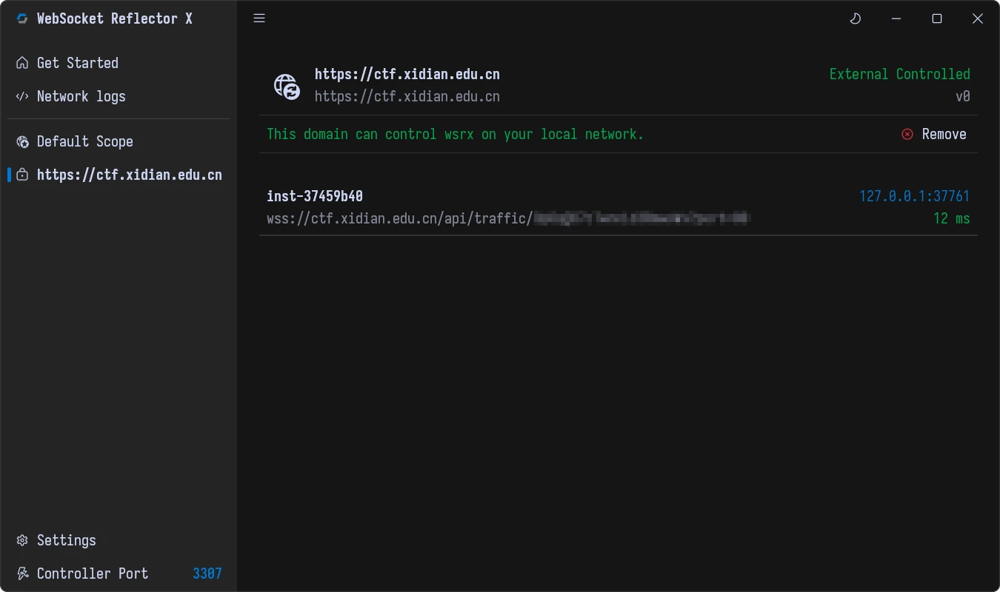
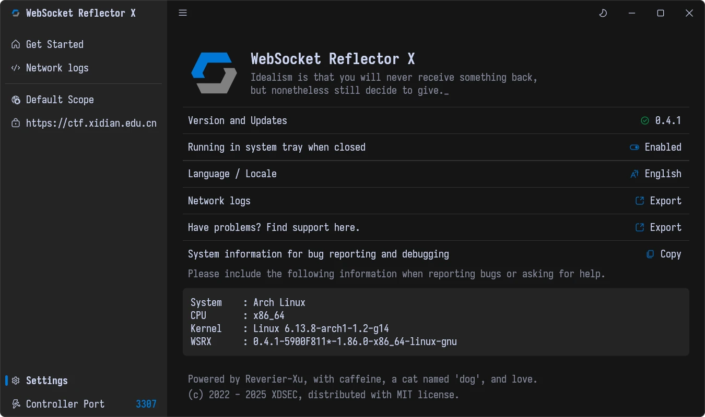

# WebSocket Reflector X

Controlled TCP-over-WebSocket forwarding tunnel.

[Crate Homepage](https://crates.io/crates/wsrx) | [Crate Docs](https://docs.rs/crate/wsrx/latest) | [Local daemon API Docs](docs/API.md)

## Notes

WebSocket Reflector X 0.2.0 has completely rewritten the GUI in Qt/C++, it's daemon and the [crate](https://crates.io/crates/wsrx) are still written in pure safe Rust.

The daemon (cli) could be used standalone.

New desktop app using HTTP API to communicate with the daemon, and stream logs from daemon's stdout. The daemon is running as a child process of the desktop app.

This app is still in development now.

## Usage

### Compile

```bash
cmake -B build -DCMAKE_BUILD_TYPE=Release -G Ninja
cmake --build /home/reverier/Code/Rust/wsrx/build --config Release --target all
```

CMake will automatically call cargo to build the daemon.

You can find two binaries inside the `build/bin` directory, `wsrx` and `wsrx-desktop`. `wsrx` is the cli daemon, and `wsrx-desktop` is the desktop app.

If you don't want to build the desktop app and only want to use the cli daemon, you can just run:

```bash
cargo build --release
```

and find the binary in `target/release/wsrx` too.

### Run

Just run the binary. `wsrx-desktop` will automatically start `wsrx` daemon as a child process, then you can use the desktop app to control the daemon.

If you want to run the cli standalone:

```bash
./wsrx --help
```

will show you how to use the cli daemon.

In most cases, you just need run `wsrx connect wss://example.com:443` to start a tunnel proxy.

The wsrx server is also implemented in the cli daemon, you can run `wsrx serve` and access the manage API at `http://localhost:<port>/pool`.

## Further Reading

If you want to know more about the daemon's API, you can read the [API Docs](docs/API.md).

If you want to intergrate `wsrx` in your own server project, you can read the [crate docs](https://docs.rs/crate/wsrx/latest).

Also, `wsrx` is a simple tool that using plain WebSocket protocol to tunnel TCP connections, so you can implement your own server / client in other languages you like. You can read the [Protocol Docs](docs/PROTOCOL.md) for more information.

## Desktop Preview





